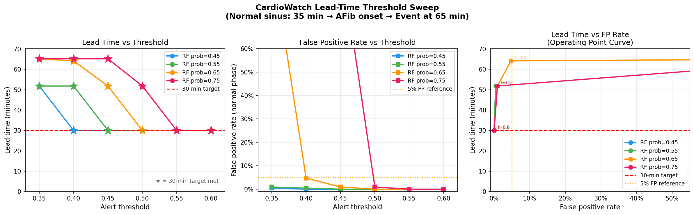

# 🫀 CardioWatch
### Early Detection & Short-Term Risk Prediction of Atrial Fibrillation Using ECG and Clinical Data


---

## Overview

CardioWatch is an ML research project on **atrial fibrillation (AFib) detection from consumer-wearable ECG**. The goal is reliable, *device-agnostic* AFib detection on single-lead signals like the Apple Watch's — because undiagnosed AFib is a leading and **preventable cause of stroke**, and catching it on everyday wearables enables earlier anticoagulation. The life-saving pathway here is **AFib detection → stroke prevention.**

The system pairs single-lead ECG models (CNN-LSTM and a device-agnostic RR-interval model) with a clinical risk-factor model (Random Forest / XGBoost), surfaced through a Streamlit dashboard with SHAP explainability and Apple Watch ECG integration.

The ECG component is built around **AFib detection using Lead I only** — the same single-lead signal Apple Watch Series 4+ records.

> **Scope note — AFib, not heart attacks.** CardioWatch detects *atrial fibrillation* (a rhythm disorder), **not** heart attacks / myocardial infarction (a coronary-artery blockage) — these are distinct conditions with different ECG signatures, and Apple Watch likewise states its ECG "is not intended to detect a heart attack." An exploratory AFib *onset-prediction* (early-warning) analysis is included, but it shows only weak, short-lead signal on RR/HRV features and is **not** presented as a clinical early-warning claim. See [results](docs/results/) and the analysis plan.

---

## 🎯 Key Results

All numbers below come from the **pre-registered, leakage-safe** run in
`docs/results/<run_id>/` (patient-grouped CPSC hold-out, $n{=}1{,}376$, Lead I).
The headline is the **controlled comparison**: a device-agnostic timing model is
statistically indistinguishable from a deep model on matched data.

| Model | Input | AUC (hold-out) | Notes |
|---|---|---|---|
| RR + RF (device-agnostic) | ECG Lead I | **0.935** | timing features only |
| CNN-LSTM (CPSC only) | ECG Lead I | **0.949** | vs RR: ΔAUC −0.013, **DeLong p = 0.33 (n.s.)** |
| CNN-LSTM (combined) | ECG Lead I | 0.975 | data-asymmetric *deployment* model (adds PhysioNet 2017) |
| Random baseline | ECG Lead I | 0.502 | sanity floor |
| Random Forest (clinical) | Clinical (separate cohort) | 0.954 | distinct population — not fused |
| XGBoost (clinical) | Clinical (separate cohort) | 0.927 | threshold via F-β (β=2) |

**Cross-device (device-agnostic RR + RF, zero-shot):** MIT-BIH Holter AUC **0.907**;
Apple Watch accuracy **0.91 (95% CI 0.80–0.96)** — *exploratory* (54 recordings,
one confirmed AFib, device-classifier labels).

> **Scope:** CardioWatch detects **atrial fibrillation → stroke prevention**, not
> heart attacks. Clinical+ECG **fusion is exploratory** (cross-population). The old
> "30-minute lead time" claim is retired; detection is near-instant once AFib is
> present, and an exploratory **onset-prediction** analysis is modest (AUC ≈ 0.66).

---

## 🔑 Key Finding — Domain Gap

A CNN-LSTM trained only on hospital ECGs (CPSC 2018, 500 Hz) drops to **~0.50 (random chance)** on Apple Watch recordings. Root cause: the model learns device-specific waveform patterns, not device-agnostic cardiac patterns.

**Two solutions implemented:**
- **RR + RF (device-agnostic):** timing features only. Pre-registered CPSC hold-out AUC **0.935** (indistinguishable from the deep model, DeLong p=0.33); zero-shot MIT-BIH Holter AUC **0.907**; Apple Watch **49/54** (exploratory). Transfers across devices with no retraining.
- **CNN-LSTM combined:** trained on CPSC 2018 + PhysioNet 2017 (AliveCor wearable). CPSC hold-out AUC **0.975** — a data-asymmetric *deployment* model (more, heterogeneous training data), not a same-data comparison.

Consistent with Bahrami Rad et al. (2024): device-agnostic features generalize across platforms; deep learning features do not without cross-device training.

---

## Project Structure

```
cardiowatch/
├── data/
│   ├── raw/
│   │   ├── heart.csv                          # Kaggle clinical dataset
│   │   ├── classification-of-12-lead-.../     # CPSC 2018 ECG
│   │   │   └── training/cpsc_2018/
│   │   ├── challenge_2017/.../training2017/   # PhysioNet 2017 (AliveCor wearable)
│   │   └── mit_afib/files/                    # MIT-BIH AFib database
│   ├── processed/                             # Model checkpoints and scalers (gitignored)
│   │   ├── scaler.pkl
│   │   ├── rf_model.pkl
│   │   ├── xgb_model.pkl
│   │   ├── cnn_lstm_best.pt                   # CPSC-only, AUC=0.968
│   │   ├── cnn_lstm_combined_best.pt          # Combined, AUC=0.974
│   │   ├── cnn_lstm_cv_best.pt                # Best of 3-fold CV (most validated)
│   │   ├── cnn_lstm_cv_results.json           # Per-fold metrics + aggregate CI
│   │   ├── fusion_model.pkl                   # Calibrated fusion (learned weights)
│   │   └── rr_rf_model.pkl
│   └── apple_health_export/                   # Personal Apple Watch ECG exports (gitignored)
│       ├── apple_health_export_urmi/electrocardiograms/
│       ├── apple_health_export_Mihir/electrocardiograms/
│       ├── apple_health_export_saurabh/electrocardiograms/
│       └── apple_health_export_steven/electrocardiograms/
├── src/
│   ├── preprocessing/
│   │   ├── clinical.py                # Imputation, encoding, normalization, split → scaler.pkl
│   │   ├── ecg_dataset.py             # PyTorch Dataset for CPSC 2018 (AFib SNOMED 164889003)
│   │   ├── ecg_dataset_combined.py    # Combined CPSC 2018 + PhysioNet 2017 Dataset
│   │   ├── ecg_filter.py              # Bandpass filter (0.5–100 Hz), Lead I extraction, windowing
│   │   └── smote_balance.py           # SMOTE class imbalance handling
│   ├── models/
│   │   ├── random_forest.py           # RF baseline with 5-fold CV + 95% CI → rf_model.pkl
│   │   ├── xgboost_model.py           # XGBoost with threshold tuning + 95% CI → xgb_model.pkl
│   │   ├── cnn_lstm.py                # CNN-LSTM architecture definition
│   │   ├── train_cnn_lstm.py          # CPSC-only training → cnn_lstm_best.pt
│   │   ├── train_cnn_lstm_combined.py # Combined training → cnn_lstm_combined_best.pt
│   │   ├── train_cnn_lstm_cv.py       # 3-fold CV training → cnn_lstm_cv_best.pt + cv_results.json
│   │   ├── rr_afib_detector.py        # RR traditional ML → rr_rf_model.pkl
│   │   ├── fusion.py                  # Late fusion utility (legacy hardcoded weights)
│   │   └── fusion_calibrated.py       # Calibrated fusion with learned weights → fusion_model.pkl
│   ├── evaluation/
│   │   ├── metrics.py                 # Recall, AUC-ROC, F1, confusion matrix
│   │   ├── confidence_intervals.py    # 95% CI: bootstrap (CNN-LSTM), t-dist (CV), Wilson (proportions)
│   │   ├── shap_explainer.py          # SHAP TreeExplainer for RF and XGBoost
│   │   ├── lead_time.py               # Lead-time evaluation using real CPSC recordings
│   │   ├── lead_time_sweep.py         # Threshold sweep → docs/lead_time_tradeoff.png
│   │   └── evaluate_mitbih_afib.py    # MIT-BIH cross-device validation (RR model)
│   └── dashboard/
│       └── app.py                     # Streamlit dashboard with fusion + alert log
├── notebooks/
│   └── CardioWatch_Complete.ipynb
├── configs/
│   └── config.yaml
├── docs/
│   ├── aw_2022_08_23_rpeaks.png       # Apple Watch R-peak detection visualization
│   ├── lead_time_evaluation.png       # Single operating point (threshold=0.50, rf=0.75)
│   ├── lead_time_tradeoff.png         # Detection-latency vs FP-rate operating curve
│   ├── roc_curve_cnn_lstm.png
│   └── shap_summary.png
├── requirements.txt
└── README.md
```

---

## Datasets

| Dataset | Source | Size | Purpose |
|---|---|---|---|
| Heart Failure Prediction | [Kaggle](https://www.kaggle.com/datasets/fedesoriano/heart-failure-prediction) | 918 samples, 11 features | Clinical RF/XGBoost training |
| PhysioNet 2020 (CPSC subset) | [Kaggle mirror](https://www.kaggle.com/datasets/gamalasran/physionet-challenge-2020) | 6,877 ECG recordings, 500 Hz | CNN-LSTM primary training |
| PhysioNet Challenge 2017 | [PhysioNet](https://physionet.org/content/challenge-2017/1.0.0/) | 8,244 recordings, 300→500 Hz | Combined training (AliveCor wearable) |
| Apple Watch ECG | Personal export — Health app | 54 recordings, 4 people (1F, 3M) | Real-world validation only |
| MIT-BIH AFib Database | [PhysioNet](https://physionet.org/content/afdb/1.0.0/) | 25 patients, 28,104 windows, 250 Hz | Cross-device validation |

> **Note:** Raw data files are excluded from this repository (gitignored). See [Data Setup](#2-data-setup) below.

---

## Models

### CNN-LSTM Architecture

| Layer | Detail |
|---|---|
| Input | `(batch, 1, 5000)` — single Lead I channel, 10 seconds at 500 Hz |
| Conv Block 1 | Conv1d(1→32, kernel=7) + BatchNorm + ReLU + MaxPool(2) → length 2500 |
| Conv Block 2 | Conv1d(32→64, kernel=7) + BatchNorm + ReLU + MaxPool(2) → length 1250 |
| Conv Block 3 | Conv1d(64→128, kernel=7) + BatchNorm + ReLU + MaxPool(2) → length 625 |
| LSTM | 2-layer, hidden=128, batch_first=True |
| Classifier | Dropout(0.3) → Linear(128→64) → ReLU → Linear(64→1) |
| Parameters | 345,089 trainable |

**Training:** Adam lr=0.0003, batch=64, BCEWithLogitsLoss (pos_weight=6.72 for combined dataset), gradient clipping 1.0, early stopping patience=7, Gaussian noise augmentation std=0.05, M1 MPS acceleration.

### Late Fusion

```
fused_score = w_rf × clinical_prob + w_ecg × ecg_prob
alert if fused_score ≥ threshold  (0.30 XGBoost / 0.50 RF)
```

**Learned weights** (isotonic calibration + logistic regression on CPSC val set):
- RF weight: 0.441 | ECG weight: 0.559 (learned from data, not hardcoded)
- Calibrated fusion AUC: 0.994 | Brier score: 0.025
- Fallback: 0.6 × clinical + 0.4 × ECG if fusion_model.pkl not found

> **Limitation:** RF and CNN-LSTM were trained on separate patient populations. Fusion weights were learned on CPSC ECG scores paired with sampled clinical scores — not from the same patients. Weights will be updated once Apple Watch volunteer data with clinical features is available.

### RR + RF (Traditional ML, Device-Agnostic)

Detects AFib using only heartbeat timing features — device-agnostic by design.

Key features: `rr_cv` (coefficient of variation), `rr_pnn50`, `rr_mad`, `rr_rmssd`, `rr_iqr`, `rr_pnn20`, `rr_kurtosis`

Hard rule: if RR CV < 0.15 → cap score at 0.25 (clinical AFib threshold override)

Apple Watch preprocessing: skip first 5s (electrode placement artifact) + resample 512→500 Hz + µV→mV conversion

---

## Why AFib and Why Lead I?

Atrial Fibrillation is the world's most common serious arrhythmia, affecting ~37 million people and being a leading cause of stroke. Unlike most arrhythmias, AFib has two unmistakable electrical signatures visible in any single lead — absent P waves and irregular R-R intervals — making it reliably detectable from Lead I alone.

Apple Watch received FDA clearance for AFib detection in 2018. CardioWatch's focus is making that single-lead AFib detection **robust across devices** (hospital, Holter, AliveCor, Apple Watch) — since the clinical value of catching AFib early is **stroke prevention through timely anticoagulation**. The clinical risk-factor model is reported as a separate cohort, not fused into a device-deployable risk score (see limitations).

---

## Quick Start

### Prerequisites

- Python 3.9+
- Apple M1/M2/M3 recommended (MPS GPU acceleration enabled automatically)
- [Kaggle account](https://www.kaggle.com) with API credentials configured

### 1. Clone and Set Up Environment

```bash
git clone https://github.com/UShah1996/cardiowatch.git
cd cardiowatch

python3 -m venv venv
source venv/bin/activate        # Mac/Linux
# venv\Scripts\activate         # Windows

pip3 install -r requirements.txt
```

### SJSU COE HPC Paper Run

Final PSB-ready numbers should be generated through the SJSU COE
JupyterHub terminal + SLURM pipeline, not from stale laptop artifacts.
See `docs/SJSU_COE_HPC_RUNBOOK.md` for the full runbook.

```bash
git checkout fix/clinical-methodology-and-dashboard
git pull

bash scripts/hpc/sjsu_setup.sh
bash scripts/hpc/submit_pipeline.sh
```

The pipeline writes compact, commit-safe summaries to
`docs/results/<run_id>/` and keeps raw data/checkpoints under ignored
`data/raw/` and `data/processed/`.

### 2. Data Setup

```bash
# Configure Kaggle credentials (skip if already done)
mkdir -p ~/.kaggle
cp /path/to/kaggle.json ~/.kaggle/kaggle.json
chmod 600 ~/.kaggle/kaggle.json

# Clinical dataset (~50 KB)
kaggle datasets download fedesoriano/heart-failure-prediction -p data/raw --unzip

# ECG dataset — CPSC subset (~3 GB)
kaggle datasets download gamalasran/physionet-challenge-2020 -p data/raw --unzip

# PhysioNet 2017 — AliveCor wearable ECGs (~500 MB)
# Download zip from: https://physionet.org/content/challenge-2017/1.0.0/
# Then: unzip training2017.zip -d data/raw/challenge_2017/

# MIT-BIH AFib database (~440 MB) — for cross-device validation
aria2c -x 16 -s 16 \
  "https://physionet.org/static/published-projects/afdb/mit-bih-atrial-fibrillation-database-1.0.0.zip" \
  -o data/raw/mit_afib.zip
unzip data/raw/mit_afib.zip -d data/raw/mit_afib/
```

### 3. Run the Full Pipeline

```bash
# Step 1 — Clinical preprocessing (saves scaler.pkl)
python3 src/preprocessing/clinical.py

# Step 2 — SMOTE balancing
python3 src/preprocessing/smote_balance.py

# Step 3 — Clinical models
python3 src/models/random_forest.py      # saves rf_model.pkl
python3 src/models/xgboost_model.py     # saves xgb_model.pkl

# Step 4 — CNN-LSTM (CPSC 2018 only)
python3 src/models/cnn_lstm.py           # architecture check
python3 src/models/train_cnn_lstm.py    # saves cnn_lstm_best.pt (AUC=0.968)

# Step 5 — CNN-LSTM Combined (CPSC 2018 + PhysioNet 2017) — RECOMMENDED
python3 src/preprocessing/ecg_dataset_combined.py   # verify combined dataset loads
python3 src/models/train_cnn_lstm_combined.py        # saves cnn_lstm_combined_best.pt (AUC=0.974)

# Step 5b — CNN-LSTM 3-fold CV (optional, ~1 hour on M1 — most rigorous)
python3 src/models/train_cnn_lstm_cv.py --combined   # saves cnn_lstm_cv_best.pt + cv_results.json

# Step 6 — Calibrated fusion (run after RF and CNN-LSTM are trained)
python3 src/models/fusion_calibrated.py              # saves fusion_model.pkl (learned weights)

# Step 6 — RR Traditional ML (device-agnostic, Apple Watch compatible)
python3 src/models/rr_afib_detector.py  # saves rr_rf_model.pkl

# Step 7 — Evaluation
python3 src/evaluation/lead_time.py              # detection-latency validation
python3 src/evaluation/shap_explainer.py         # SHAP plots
python3 src/evaluation/evaluate_mitbih_afib.py   # MIT-BIH cross-device validation

# Step 8 — Launch dashboard
streamlit run src/dashboard/app.py

# Optional — MLflow training curves
mlflow ui   # open localhost:5000
```

---

## Validation Checklist

| Component | Command | Expected Result |
|---|---|---|
| Packages | `python3 -c "import torch, pandas, sklearn, wfdb, shap, streamlit, mlflow"` | No errors |
| Dataset | `python3 -c "import pandas as pd; df=pd.read_csv('data/raw/heart.csv'); print(df.shape)"` | `(918, 12)` |
| Clinical pipeline | `python3 src/preprocessing/clinical.py` | Train: 734, Val: 92, Test: 92 |
| SMOTE | `python3 src/preprocessing/smote_balance.py` | After SMOTE: {0: 406, 1: 406} |
| XGBoost | `python3 src/models/xgboost_model.py` | Recall: 0.980, AUC: 0.927 |
| ECG dataset (CPSC) | `python3 src/preprocessing/ecg_dataset.py` | Loaded 6877 recordings, AFib: 1221 |
| Combined dataset | `python3 src/preprocessing/ecg_dataset_combined.py` | Total: 15121, AFib: 1959 (13.0%) |
| CNN-LSTM arch | `python3 src/models/cnn_lstm.py` | Output shape: torch.Size([4, 1]) |
| CNN-LSTM (CPSC) | `python3 src/models/train_cnn_lstm.py` | Best AUC-ROC ≥ 0.96 |
| CNN-LSTM (Combined) | `python3 src/models/train_cnn_lstm_combined.py` | Best AUC-ROC ≥ 0.97 |
| RR model | `python3 src/models/rr_afib_detector.py` | AUC-ROC: 0.957, Apple Watch: 6/6 |
| Detection latency | `python3 src/evaluation/lead_time.py` | Reports latency after AFib onset + normal-phase FP rate |
| RF baseline | `python3 src/models/random_forest.py` | Recall ≥ 0.90, AUC ≥ 0.94 |
| MIT-BIH validation | `python3 src/evaluation/evaluate_mitbih_afib.py` | AUC-ROC ≥ 0.90 |
| Dashboard | `streamlit run src/dashboard/app.py` | Opens at localhost:8501 |

---

## What Is Built

### Weeks 1–2: Environment & Setup
- Python 3.9 virtual environment, GitHub repo, Kaggle API, PhysioNet account
- Literature review: Jin et al. (2022), Chadaga (2025), AHA (2025), Salet et al. (2024), Bahrami Rad et al. (2024)

### Week 3: Clinical EDA
- Kaggle Heart Failure dataset (918 × 12), EDA with zero-cholesterol detection (172 rows), class balance (508 vs 410), correlation heatmap

### Week 4: Clinical Preprocessing Pipeline
- Median imputation, binary + one-hot encoding, MinMaxScaler, stratified 80/10/10 split
- SMOTE on training set → balanced {0: 406, 1: 406}
- Scaler saved to `data/processed/scaler.pkl`

### Week 5: ECG Signal Pipeline
- Butterworth bandpass filter (0.5–100 Hz), Lead I extraction by name lookup
- CPSC subset (6,877 recordings), AFib binary classification (SNOMED `164889003`)

### Week 6a: Model Architecture & RF Baseline
- CNN-LSTM: 3 Conv1d blocks [32, 64, 128] + 2-layer LSTM + classifier, 345k params
- Random Forest 5-fold CV: **Recall 0.902 | AUC-ROC 0.945**

### Week 6b: Streamlit Dashboard
- SHAP TreeExplainer for RF and XGBoost feature importance
- Dashboard: model selector (RF/XGBoost), risk gauge, SHAP bar chart, rolling risk history, alert history log, fusion architecture explainer
- Late fusion: `fused_score = 0.6 × RF/XGB + 0.4 × CNN-LSTM`

### Weeks 7–8: XGBoost + CNN-LSTM Training
- XGBoost with threshold tuning at 0.30: **Recall 0.980 | AUC-ROC 0.927**
- CNN-LSTM training with Gaussian noise augmentation, gradient clipping, early stopping, MPS acceleration
- **CPSC-only best checkpoint (epoch 28): AUC-ROC 0.968 | Recall 0.931 | F1 0.844**

### Weeks 9–10: Domain Gap Discovery & Solutions

#### Detection-Latency Evaluation
- Built from real CPSC recordings: 35 min Normal Sinus Rhythm → 31 min AFib
- **Detection latency:** rerun with `src/evaluation/latency_bootstrap.py` for paper-ready median/IQR.
- Threshold sweep now reports a latency-vs-false-positive operating curve.
  Bootstrap transitions should be used for the paper-ready median/IQR latency result.
- 

#### Domain Gap Discovery
- CNN-LSTM (CPSC-only) tested on 6 Apple Watch recordings → all scores ~0.50 (random chance)
- Root cause: model learned hospital ECG waveform patterns, not device-agnostic cardiac patterns

#### Solution 1 — RR Traditional ML
- Device-agnostic RR interval features (CV, RMSSD, pNN50, MAD, IQR, entropy)
- Apple Watch preprocessing: skip first 5s artifact + resample 512→500 Hz + CV hard rule
- **Apple Watch: 49/54 = 91% across 4 people (1 female, 3 male)**
- **MIT-BIH AFib validation: AUC=0.909, Recall=0.924, F1=0.804 (28,104 windows, 25 patients, zero-shot)**

#### Solution 2 — Combined CNN-LSTM Training
- Combined dataset: CPSC 2018 (hospital, 500 Hz) + PhysioNet 2017 (AliveCor wearable, 300→500 Hz)
- Total: 15,121 recordings, 1,959 AFib (13%), pos_weight=6.72
- Pre-registered CPSC hold-out AUC **0.975** — a data-asymmetric *deployment* model (more, heterogeneous training data), not a same-data comparison with the CPSC-only model (0.949) or RR+RF (0.935).

---

## Apple Watch Validation Results

Real Apple Watch ECG exports from 4 volunteers, 54 recordings with **one** confirmed
AFib. **Exploratory only:** with a single positive, "accuracy" is dominated by
specificity and sensitivity is effectively unmeasured; labels are the watch's own
classifier, not clinical adjudication.

| Model | Apple Watch (exploratory) | Notes |
|---|---|---|
| CNN-LSTM (CPSC only) | ~0.50 ❌ | Domain gap — random chance |
| RR + RF (device-agnostic) | 49/54, acc 0.91 (95% CI 0.80–0.96) | timing features, no retraining |
| CNN-LSTM (combined) | acc 0.91 (95% CI 0.80–0.96) | deployment model |

**Per-person breakdown (RR + RF):**

| Person | Recordings | Accuracy | Notes |
|---|---|---|---|
| Person 1 (F) | 9 | 9/9 = 100% | Includes 1 confirmed AFib — correctly detected |
| Person 2 (M) | 27 | 24/27 = 89% | 3 FP from ectopic beats (CV borderline 0.19–0.23) |
| Person 3 (M) | 15 | 14/15 = 93% | 1 FP at HR=125 (tachycardia + irregular RR) |
| Person 4 (M) | 3 | 2/3 = 67% | Small sample — 1 FP |

---

## Evaluation Summary (pre-registered hold-out)

Reported as measured numbers, not pass/fail "targets." ECG models are on the
patient-grouped CPSC hold-out (n=1,376, Lead I); clinical models on their own
test split (separate cohort).

| Metric | RR + RF | CNN-LSTM (CPSC) | CNN-LSTM (combined) | RF (clinical) | XGBoost (clinical) |
|---|---|---|---|---|---|
| AUC | 0.935 | 0.949 | 0.975 | 0.954 | 0.927 |
| Recall | 0.803 | 0.959 | 0.918 | 0.941 | 0.961 |
| F1 | 0.679 | 0.701 | 0.837 | 0.914 | 0.852 |

Primary controlled comparison: RR + RF vs CNN-LSTM (CPSC), ΔAUC −0.013, **DeLong
p = 0.33, McNemar p = 0.40 (Holm)** — not significant. Cross-device (RR, zero-shot):
MIT-BIH AUC 0.907. Detection latency: near-instant once AFib present (not a
lead-time claim). Onset prediction (exploratory): pooled AUC ≈ 0.66.

---

## Dashboard Features

```bash
streamlit run src/dashboard/app.py
```

- **Model selector:** Switch between Random Forest and XGBoost — SHAP chart updates live
- **Fusion explainer:** Collapsible diagram showing how clinical + ECG scores combine
- **Risk gauge:** Green/yellow/red zones with threshold line (30% XGBoost / 50% RF)
- **SHAP bar chart:** Top 6 features color-coded red (risk-increasing) / green (risk-reducing)
- **CNN-LSTM panel:** Always-visible performance metrics (AUC, Recall, detection-latency caveat)
- **ECG upload:** Apple Watch CSV → CNN-LSTM inference → fused risk score
- **Rolling history:** Last 30 readings with alert threshold line
- **Alert log:** Timestamped log of every threshold crossing with model, clinical, ECG, and fused scores

> **SHAP Note:** Cholesterol and RestingBP show inverse SHAP values (lower = higher risk). This is a known dataset artifact — patients with advanced cardiac disease often have suppressed cholesterol (statins) and low BP (reduced cardiac output). MaxHR inverse relationship is clinically correct.

---

## References

1. World Health Organization — Cardiovascular Diseases Fact Sheet (2021)
2. Soriano — Heart Failure Prediction Dataset, Kaggle (2021)
3. Asran — PhysioNet Challenge 2020: Classification of 12-lead ECGs, Kaggle
4. American Heart Association — AI tool detected structural heart disease using a smartwatch (2025)
5. Apple Inc. — HealthKit Framework Documentation (2024)
6. Salet et al. — Predicting Myocardial Infarction in Primary Care, PLoS ONE (2024)
7. Jin et al. — Transfer learning for single-lead ECG myocardial injury prediction, JAMIA (2022)
8. Chadaga — Predicting heart attack using time series data, Mendeley Data (2025)
9. Bahrami Rad et al. — A Crowdsourced AI Framework for Atrial Fibrillation Detection in Apple Watch and Kardia Mobile ECGs, Sensors 24(17):5708, PMC11398038 (2024)
